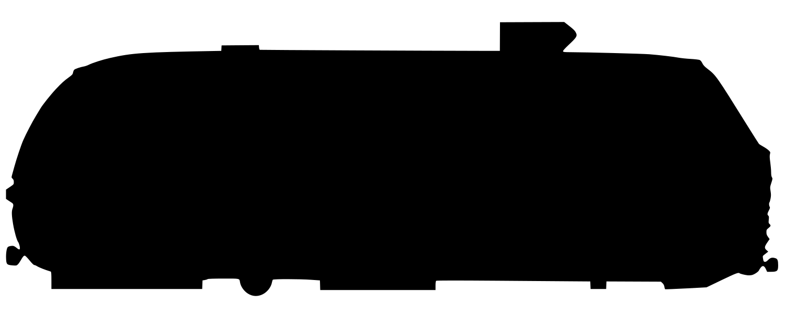

# Section Tunnel

**Section Tunnel** is a self-contained browser application for qualitative, two-dimensional aerodynamic shape comparison. It uses a GPU-accelerated D2Q9 lattice-Boltzmann fluid solver implemented with WebGL2.

The application can display smoke, local speed, and vorticity; estimate relative lift and drag coefficients; create built-in bodies; import selectable SVG silhouettes; and manually save the tunnel configuration in browser storage.

> This is an educational and comparative flow-visualization tool. It is not validated engineering CFD, and its displayed force coefficients should not be treated as absolute real-world aerodynamic data.

---



## Files

The application is contained in one HTML file:

```text
wind-tunnel-stateful-manual-save.html
```

No separate JavaScript file, stylesheet, web server, package manager, or external library is required.

Open the HTML file directly in a modern browser.

Recommended browsers:

- Google Chrome
- Microsoft Edge v109.* on Win7 or later
- Mozilla Firefox >115.* (Win7 will show "WebGL2 with float render targets is required for this demo and is not available in this browser.")
- Brave v1.48.* works

The browser and GPU must support:

- WebGL2
- Floating-point render targets
- The `EXT_color_buffer_float` WebGL extension

If those features are unavailable, the page displays a WebGL compatibility error instead of starting the simulation.

---

## Starting the application

1. Extract the ZIP file, if applicable.
2. Double-click `wind-tunnel-stateful-manual-save.html`.
3. Allow the browser a moment to compile the GPU shaders and benchmark the available graphics hardware.
4. The simulation starts with flow moving from right to left.

The arrow at the top of the page indicates the flow direction:

```text
◀ FLOW
```

The right edge is the inlet. The left edge is the outlet.

At startup, the application checks browser `localStorage` for a previously saved state.

- If a saved state exists, it is restored automatically.
- If no saved state exists, a cylinder is added as the starter body.
- The application does **not** automatically save changes.
- State is written only when **Save state** is clicked.

The live fluid and smoke field are not restored. After loading a state, the flow restarts and develops around the restored geometry.

---

# Example: compare a car profile with and without a ground plane

This example demonstrates a normal test workflow.

1. Open the application.
2. Click **Clear bodies** to remove the starter cylinder.
3. Under **Bodies**, choose an SVG side-profile file with **Import SVG**.
4. Click the imported body in the tunnel to select it.
5. Drag the body toward the lower part of the tunnel.
6. Use the square handle to resize it.
7. Use the round handle, or the rotation buttons, to level the body.
8. Select **smoke** and allow the wake to develop.
9. Select **speed** to inspect accelerated and stagnant regions.
10. Select **vorticity** to inspect separated shear layers and wake rotation.
11. Observe the relative drag and lift readings.
12. Enable **ground plane**.
13. Click **Reset flow** and allow the new flow field to develop.
14. Compare the wake, lift, and drag values with the earlier case.
15. Click **Save state** to store the current configuration manually.

For a meaningful comparison, change only one variable at a time and allow the displayed coefficients to settle before recording them.

---

# Tunnel display

## Test section

The large central panel is the simulated wind-tunnel test section.

It contains two overlaid canvases:

- A WebGL canvas for the fluid visualization
- A 2D canvas for selection handles, force arrows, and body controls

Flow enters from the right and travels toward the left.

## Drag meter

The **DRAG Cd** meter displays a relative drag coefficient based on momentum exchange between the fluid and the combined obstacle field.

The amber horizontal force arrow points in the drag direction.

## Lift meter

The **LIFT Cl** meter displays a relative lift coefficient.

- Positive lift is shown on the positive side of the meter.
- Negative lift or downforce is shown on the negative side.
- The cyan force arrow indicates the lift direction.

The coefficients are normalized using lattice freestream velocity and the combined obstacle frontal height. They are intended for relative comparisons within the application.

---

# Tunnel controls

## Speed

The **Speed** slider changes the inlet flow velocity.

The control ranges from zero to a displayed maximum of approximately 150 mph. The mph value is a presentation scale derived from the lattice velocity; it does not establish a full real-world Reynolds-number match.

Changing speed does not instantly rebuild the existing flow field. The simulation transitions toward the new inlet condition.

Use **Reset flow** after changing speed when you want a clean test at the new setting.

---

## Smoke

Select **smoke** to display an advected tracer field.

The tracer is injected in horizontal bands near the right-hand inlet and transported by the simulated velocity field.

Use this mode to examine:

- Stream paths
- Wake shape
- Flow separation
- Recirculation
- Interaction between multiple bodies

The smoke is a passive visualization tracer rather than a physical particulate model.

---

## Speed visualization

Select **speed** to display local velocity magnitude.

Typical interpretation:

- Dark regions: low-speed or stagnant flow
- Blue and cyan: moderate speed
- Amber and pale regions: higher speed

The color scale is normalized relative to the selected inlet velocity.

Use this mode to identify:

- Accelerated flow over a body
- Low-speed wakes
- Stagnation zones
- Restricted passages
- Ground-clearance effects

---

## Vorticity visualization

Select **vorticity** to display local two-dimensional rotational flow.

The application estimates vorticity from neighboring velocity cells.

- Warm colors indicate rotation in one direction.
- Cool colors indicate rotation in the opposite direction.
- The neutral background indicates weak local rotation.

Use this mode to identify:

- Separated shear layers
- Alternating wake vortices
- Recirculation
- Strong rotational regions near body edges


## Pressure visualization

Select **pressure** to display relative lattice pressure.

In the isothermal D2Q9 lattice-Boltzmann model, pressure is proportional to density:

```text
p = ρ / 3
```

The display uses density deviation from the freestream value:

- Blue: lower relative pressure
- Pale neutral: approximately freestream pressure
- Orange/red: higher relative pressure

The scale changes with inlet velocity squared so that the view remains useful across speed settings. It is a relative lattice-pressure visualization, not a calibrated pressure measurement in pascals.

Use this mode to identify:

- High-pressure stagnation regions
- Low-pressure accelerated flow
- Pressure differences across a foil
- Pressure recovery behind a body
- Underbody and ground-clearance pressure changes


---

## Ground plane

Enable **ground plane** to add a stationary solid strip along the bottom of the lattice.

The ground plane affects the flow but is excluded from the reported body-force summation.

Use it to compare:

- Free-air versus near-ground behavior
- Vehicle underbody flow
- Ground clearance
- Wing or diffuser proximity effects

After toggling the ground plane, use **Reset flow** for a clean comparison.

---

## Detail

The **Detail** selector controls lattice resolution.

| Setting | Lattice size |
|---|---:|
| Auto | Chosen by startup GPU benchmark |
| Low | 384 × 192 |
| Standard | 512 × 256 |
| High | 768 × 384 |
| Ultra | 1024 × 512 |

Higher resolutions produce finer obstacle rasterization and flow detail but require substantially more GPU processing and memory.

Changing resolution:

- Reallocates the simulation textures
- Rescales existing bodies
- Rescales freehand drawing
- Restarts the fluid field

**Auto** runs a startup benchmark and selects the largest tested setting expected to fit the application's simulation-time target.

---

## Pause / Run

Click **Pause** to stop fluid updates.

While paused:

- The current visualization remains displayed.
- Bodies may still be selected and repositioned.
- Controls remain available.
- The fluid and smoke fields do not advance.

The button changes to **Run**. Click it again to resume simulation.

The pause/run state is included in a manually saved configuration.

---

## Reset flow

Click **Reset flow** to reinitialize:

- Fluid density
- Fluid velocity
- Smoke tracer
- Lift estimate
- Drag estimate

It preserves:

- Bodies
- Imported SVG shapes
- Freehand obstacles
- Body position and scale
- Ground-plane setting
- Speed and display settings

Use this after making a geometry, speed, or ground-plane change when you want the new case to begin from a uniform freestream.

---

## Clear bodies

Click **Clear bodies** to remove:

- All built-in bodies
- All imported SVG bodies
- All freehand drawing

The fluid field continues running around the now-empty tunnel unless separately reset.

This action does not delete the manually saved state in browser storage.

---

# Manual state controls

## Save state

Click **Save state** to write the current configuration to browser `localStorage`.

The saved data includes:

- Lattice/detail setting
- Speed
- Visualization mode
- Ground plane
- Pause/run state
- Brush size
- Selected tool
- Built-in bodies
- Imported SVG body masks
- Body positions
- Body scales
- Body rotations
- Body flip states
- Selected body
- Freehand obstacle bitmap

There is no automatic five-second save, save-on-change, or save-on-exit.

Saving again replaces the earlier saved state for this application and browser origin.

## Load state

Click **Load state** to restore the most recently saved configuration.

Loading reconstructs all saved bodies and freehand geometry, resets the fluid field, and then restores the saved pause/run condition.

The live GPU velocity, density, smoke, and force textures are not serialized. Therefore, the flow wake starts over after loading.

## Clear saved state

Click **Clear saved state** to delete the stored configuration from browser `localStorage`.

This does not alter the currently running tunnel. It only removes the saved copy.

After clearing the saved state, reloading the page starts with the default cylinder unless another state is saved first.

## Browser-storage scope

A saved state belongs to the browser storage origin used to open the file.

For a local file, browser behavior can vary by browser and profile. A saved state may not be shared between:

- Different browsers
- Normal and private/incognito windows
- Different browser profiles
- A local `file:` URL and a hosted `https:` URL
- Different copies or locations of the HTML file

---

# Tool controls

## Select

Choose **Select** to work with built-in and imported SVG bodies.

With a body selected:

- Drag the body to move it.
- Drag the square handle to scale it.
- Drag the round handle to rotate it.
- Use the body-control buttons for flip, rotation, size, and deletion.

Click empty tunnel space to clear the current selection.

Freehand drawing is not a selectable body.

## Draw

Choose **Draw**, then click and drag in the tunnel to paint an arbitrary solid obstacle.

The painted region becomes part of the obstacle bitmap used by the fluid solver.

Use Draw for:

- Quick shape experiments
- Walls and barriers
- Small appendages
- Rough profile changes
- Flow restrictions

Drawn geometry is saved as part of the manually saved state.

## Erase

Choose **Erase**, then drag over freehand geometry to remove it.

Erase affects only freehand obstacle ink. It does not erase:

- Built-in bodies
- Imported SVG bodies
- The ground plane

Use **Delete selected** to remove a selectable body.

## Brush

The **Brush** slider controls the Draw and Erase radius.

The brush size is scaled with lattice density so its apparent role remains reasonably consistent when resolution changes.

A smaller brush is useful for fine corrections. A larger brush is useful for quickly creating or removing large regions.

---

# Body controls

## Cylinder

Click **+ Cylinder** to add a circular body.

A cylinder is useful for observing:

- Symmetric wake development
- Vortex shedding
- Drag from a bluff body
- Ground-plane interaction

## Box

Click **+ Box** to add a rectangular body.

Use it to examine sharp-edge separation and broad bluff-body wakes.

## Wedge

Click **+ Wedge** to add a triangular wedge.

Use it to compare a tapered profile with a box or cylinder.

## Plate

Click **+ Plate** to add a thin rectangular plate.

Rotate the plate to study incidence, separation, lift, and drag.

At very small thicknesses, lattice resolution strongly influences the rendered obstacle.

## Car body

Click **+ Car body** to add the built-in fastback-style side silhouette.

The built-in body is a polygon defined in the JavaScript source and behaves as a selectable object.

## Foil selector

The **Foil** list selects an airfoil profile.

Available profiles in the current build include:

- NACA 0016 — symmetric
- NACA 0030 — thick fairing or strut
- NACA 2412 — mild camber
- NACA 4412 — greater camber
- NACA 9412 — high camber
- Race wing — custom maximum-camber profile

Select a profile, then click **+ Add foil**.

The profile leading edge faces the incoming flow from the right.

## Import SVG

Use **Import SVG** to add a custom silhouette as a selectable body.

Recommended SVG preparation:

- Save as Plain SVG.
- Use a filled silhouette.
- Use a transparent background.
- Remove any page-sized white rectangle.
- Remove the source bitmap after tracing.
- Convert objects to paths where practical.
- Keep only the intended visible silhouette.
- Avoid external images, scripts, filters, and linked resources.
- Point the vehicle nose or body leading edge toward the right.

The importer:

1. Reads the selected SVG.
2. Renders it to a temporary canvas.
3. Detects the visible opaque bounds.
4. Crops unused page area.
5. Converts the visible result into an obstacle mask.
6. Creates a selectable bitmap body.
7. Centers it in the tunnel.

After import, use Select to move, scale, rotate, flip, or delete it.

The imported mask, not the original SVG XML, is stored in a saved state.

---

## Flip

Click **Flip ⇅** to mirror the selected body vertically.

For a cambered foil, this can change lift into downforce or vice versa.

For an asymmetric imported body, it produces a vertical mirror image.

## Rotate left

Click **⟲ 5°** to rotate the selected body by 5 degrees in one direction.

## Rotate right

Click **⟳ 5°** to rotate the selected body by 5 degrees in the opposite direction.

## Decrease size

Click **− size** to reduce the selected body's scale by approximately 10 percent.

## Increase size

Click **+ size** to increase the selected body's scale by approximately 10 percent.

## Delete selected

Click **Delete selected** to remove the currently selected built-in or imported SVG body.

It does not remove freehand drawing. Use Erase or Clear bodies for freehand geometry.

---

# Mouse, touch, and keyboard controls

## Mouse

With Select active:

- Click a body to select it.
- Drag the selected body to move it.
- Drag the square handle to scale it.
- Drag the round handle to rotate it.
- Click empty space to deselect.

## Touch

With a body selected:

- Drag with one finger to move it.
- Pinch with two fingers to scale it.
- Twist two fingers to rotate it.

## Keyboard

The tunnel panel must have focus. Click it once before using keyboard commands.

| Key | Action |
|---|---|
| Left arrow | Move selected body left |
| Right arrow | Move selected body right |
| Up arrow | Move selected body up |
| Down arrow | Move selected body down |
| Shift + arrow | Move by a larger increment |
| `r` | Rotate by 5 degrees |
| `R` or Shift + `r` | Rotate by −5 degrees |
| `f` | Flip vertically |
| `+` or `=` | Increase size |
| `-` or `_` | Decrease size |
| Delete | Delete selected body |
| Backspace | Delete selected body |

---

# Recommended test procedure

For more repeatable comparisons:

1. Select one resolution and keep it unchanged across cases.
2. Select one speed and keep it unchanged.
3. Add or import the first body.
4. Position and size it.
5. Click **Reset flow**.
6. Allow the flow and coefficients to settle.
7. Record drag, lift, and qualitative wake observations.
8. Change only one geometric variable.
9. Click **Reset flow** again.
10. Allow the second case to settle.
11. Compare the results.

Examples of single-variable comparisons:

- Same car body with two ride heights
- Same foil at two angles
- Same body with and without ground plane
- Box versus wedge at equal frontal height
- Original SVG versus a streamlined revision

Because this is a transient solver, readings taken immediately after a change are not representative of a settled case.

---

# Interpretation and limitations

The application is most useful for qualitative comparisons.

Important limitations include:

- The simulation is two-dimensional.
- The lattice resolution is modest.
- Reynolds number is lattice-limited.
- The displayed mph scale is not a complete physical scaling model.
- Boundary conditions are simplified.
- Imported geometry is rasterized.
- Thin or small features may disappear or change shape on the lattice.
- Force coefficients use frontal height rather than a complete three-dimensional reference area.
- Multiple bodies are treated as one combined obstacle field for force reporting.
- The ground plane is excluded from the force summation.
- Numerical behavior can vary with speed, resolution, body size, and proximity to boundaries.

Use the results to compare configurations under identical settings, not to predict certified real-world aerodynamic coefficients.

---

# Flow generation algorithm

## Overview

The simulation uses a **two-dimensional, nine-velocity lattice-Boltzmann method**, commonly called **D2Q9 LBM**.

Instead of directly solving the macroscopic Navier-Stokes equations at every cell, LBM evolves nine particle-distribution values per lattice cell.

The nine directions are:

- One stationary population
- Four axial populations
- Four diagonal populations

From those distributions, the solver reconstructs local fluid density and velocity.

The main GPU pipeline is:

```text
Rasterize obstacles
        ↓
Initialize or retain particle distributions
        ↓
Stream distributions from neighboring cells
        ↓
Apply solid-boundary bounce-back
        ↓
Recover density and velocity
        ↓
Relax distributions toward equilibrium
        ↓
Apply sub-grid stabilization
        ↓
Advect smoke tracer
        ↓
Calculate momentum-exchange forces
        ↓
Render smoke, speed, or vorticity
```

## GPU implementation

The solver runs in WebGL2 fragment shaders.

Fluid data is stored in floating-point textures. Because WebGL render targets cannot generally be read from and written to simultaneously, the solver uses paired texture sets in a ping-pong arrangement:

1. Read the current distributions.
2. Write the next distributions to the alternate framebuffer.
3. Swap source and destination.
4. Repeat for the configured number of substeps.

At Standard resolution, the application normally performs approximately ten LBM steps per displayed animation frame. The number of substeps scales upward with lattice width.

## Equilibrium distribution

For each D2Q9 direction, the code calculates an equilibrium particle distribution from:

- Direction weight
- Local density
- Local velocity
- Direction-to-velocity dot product

The equilibrium expression is the standard low-Mach D2Q9 polynomial approximation.

The initialized freestream velocity points in the negative X direction, which produces right-to-left flow.

## Streaming

During streaming, each cell gathers particle populations from neighboring lattice cells in their corresponding directions.

This implementation uses a pull-streaming scheme:

- Each destination cell reads the population that originated at the upstream neighboring cell.
- If that neighboring cell is solid, bounce-back is applied instead.

## Collision and relaxation

After streaming, the solver calculates local density and velocity and relaxes the distributions toward equilibrium.

The base relaxation time is:

```text
TAU0 = 0.53
```

The relaxation rate determines effective lattice viscosity and numerical behavior.

Velocity magnitude is limited internally to reduce instability at excessive local speeds.

## Smagorinsky sub-grid stabilization

The collision shader estimates non-equilibrium stress components and uses them to increase the local effective relaxation time.

This is a Smagorinsky-style sub-grid model intended to stabilize under-resolved flow structures and provide additional effective dissipation where the local non-equilibrium stress is large.

It does not make the simulation equivalent to a high-resolution engineering turbulence model, but it improves robustness for interactive use.

## Solid obstacles

Built-in bodies, imported SVG masks, freehand drawing, and the optional ground plane are rasterized into one obstacle texture.

For fluid links that encounter a solid cell, the solver uses halfway bounce-back:

- The incoming particle population is reflected into its opposite lattice direction.
- The reflected momentum produces a no-slip-style stationary boundary approximation.

The accuracy of the body boundary depends on lattice resolution because all geometry ultimately becomes a pixel mask.

## Inlet and outlet

The boundary treatment is simplified:

- The right edge is forced to the selected freestream velocity.
- The top and bottom boundaries are also maintained at freestream conditions unless occupied by the ground plane.
- The left edge copies values from an adjacent interior column as an approximate outlet.

These conditions support an interactive test section but are not equivalent to a carefully validated external-flow CFD domain.

## Smoke generation

Smoke is implemented as a passive scalar dye field.

Horizontal tracer bands are injected near the right-hand inlet. Each frame, the dye shader traces backward along the local velocity field and samples the previous dye texture.

The tracer also decays slightly over time.

The smoke does not affect the fluid solution. It only visualizes the computed velocity field.

## Speed display

The speed view calculates the magnitude of the local velocity vector and maps it to a multicolor gradient normalized by inlet speed.

## Vorticity display

The vorticity view estimates the scalar two-dimensional curl:

```text
∂v/∂x − ∂u/∂y
```

It uses centered differences from neighboring lattice velocity cells.

Positive and negative rotation are mapped to different colors.

## Force calculation

Lift and drag are estimated by momentum exchange at fluid-solid interfaces.

For every fluid cell adjacent to a solid cell, the force shader accumulates the momentum reflected by bounce-back.

The full force texture is then reduced repeatedly on the GPU:

```text
full lattice
→ half width and height
→ half again
→ ...
→ one pixel
```

The final one-pixel force total is read back to JavaScript.

The code converts this force into relative coefficients using:

```text
q = 0.5 × U² × frontal height
```

and approximately:

```text
Cd = -Fx / q
Cl =  Fy / q
```

The values are low-pass filtered so the meters do not jump abruptly.

Force readback is performed every several display frames rather than every lattice step.

## Why the flow restarts after loading state

Manual state storage saves geometry and user-interface configuration, but not the live GPU textures.

A complete exact fluid-state save would require serializing several large floating-point textures containing:

- Nine distribution populations per cell
- Density and velocity data
- Dye data
- Ping-pong simulation buffers

That would create large saved states, expensive GPU readbacks, and browser-storage limitations.

The current design therefore restores the complete test configuration, initializes a uniform freestream, and allows the flow to redevelop.

---

# Troubleshooting

## The page shows a GPU setup error

Confirm that hardware acceleration is enabled in the browser and try a current version of Chrome, Edge, or Firefox.

The required WebGL extension may be unavailable on older GPUs, remote-desktop sessions, virtual machines, or systems using software rendering.

## An imported SVG does not appear

Check that the SVG contains visible opaque geometry.

Remove:

- Transparent-only paths
- A missing fill and missing stroke
- External linked images
- Unsupported filters
- Script-generated content
- Excessive empty page area

Save a simplified copy as Plain SVG.

## The imported body is a large rectangle

The SVG probably contains an opaque page-sized background rectangle.

Delete that rectangle and ensure the page background is transparent.

## The imported shape is too thin

A traced outline may contain only a narrow stroke or hollow ring.

For aerodynamic obstacle use, create a filled silhouette before saving the SVG.

## A body cannot be selected

Confirm that **Select** is active.

Freehand drawing cannot be selected. Imported SVG bodies and built-in bodies can be selected.

## Save state does not follow the file to another browser

The state is stored in browser `localStorage`, not inside the HTML file.

Use the same browser profile and origin, or manually recreate and save the state in the other browser.

## Coefficients fluctuate

The flow may still be transient, the body may be too close to a boundary, or the resolution may be insufficient.

Allow more settling time, use a higher detail setting, or enlarge the tunnel clearance around the body.

---

# License and validation

No formal engineering validation, accuracy guarantee, or certification is implied.

Before distributing the application, add an explicit software license appropriate to the project and verify any third-party source or algorithm attribution requirements.
